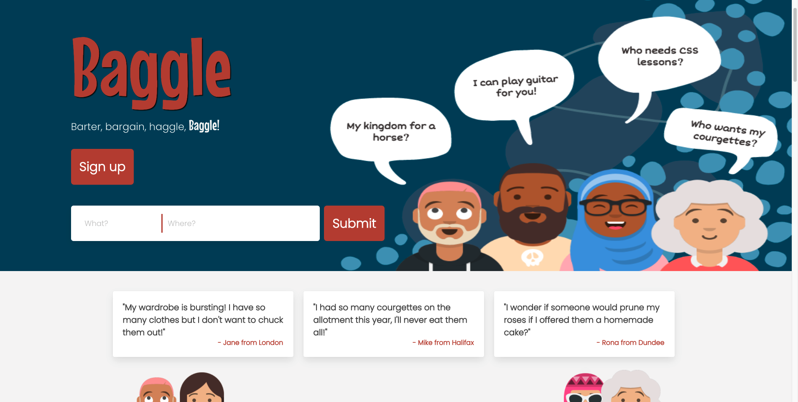
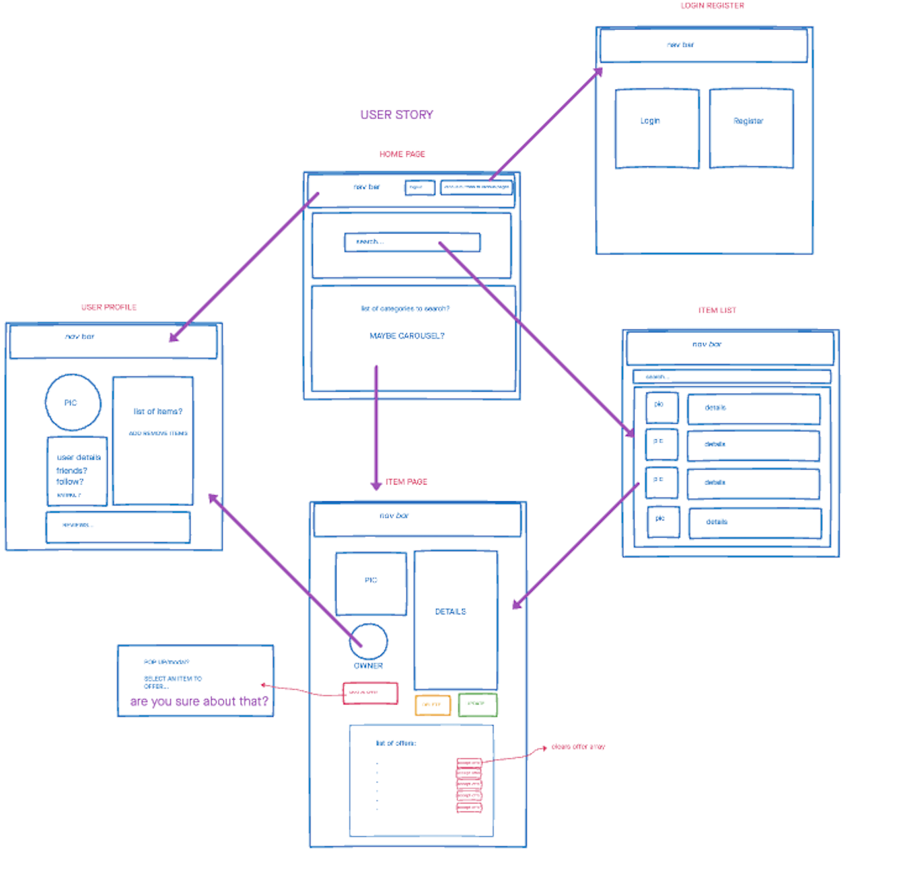

# Project-4


# Project-4 - Python, PostgreSQL, React and Flask Full Stack Application 

# Baggle, an ecommerce site to trade items instead of money.

### Created by  [Abdi](https://github.com/aozzy) ,[James](https://github.com/jamesNicholasRyan) & [Cathy](https://github.com/ketka82uk).
 




## Project overview

For the final project of the General Assembly Software Immersive Course we were tasked as a group 
to build a full stack application. The duration of the project was 9 days. After exchanging ideas
for the project we choose to develop Baggle, The idea behind Baggle came from the story of [Kyle
McDonald](https://www.cbc.ca/news/canada/from-paper-clip-to-house-in-14-trades-1.573973) who went from owning a paper clip to a house in 14 trades. We planned the project out by whiteboarding and wireframing. 
The app has been deployed on Heroku and you can find it [here](https://gabaggle.herokuapp.com/)




### Technical Requirements

- Build a full-stack application, by making your own backend and your own front-end
- Use a Python Flask API, using a Flask REST Framework to serve your data from a Postgres database
- Be a complete product, which most likely means multiple relationships and CRUD functionality for at least a couple of models
- Implement thoughtful user stories/wireframes
- Have a visually impressive design
- Be deployed online


### Technologies Used

- React
- Python
- PostgreSQL
- Flask
- Marshmallow & SQLalchemy 
- Git & GitHub
- Bulma
- Webpack
- Heroku 
- Insomnia
- Tableplus
- Babel


## Baggle

We began by planning out the core features of Baggle and identified what our MVP would look like and any functionality we could implement
as a stretch goal. We planned how our models would look like, We identified early on that the key component of the site would be the trade system so we designed our model with this in mind. The Items model would have a many to many relationship with itself, this would enable us to keep track of items offered for other items and implement the swap system. 


The user model would also have a many to many relationship
with itself to allow followers for users.
We wireframed out what the user story would look like before we began coding and also whiteboared out our models.
We used our own API for the items and agreed on what the fields on the item data would consist of. After the planning stage we began
building the backend setting up our models controllers and serializers. Please see below for the Items model.


```
class Item(db.Model, BaseModel):

    

    __tablename__ = 'items'
    id = db.Column(db.Integer, primary_key=True)
    # ? nullable=False means it's required.
    # ? unique=True means its unique.

    name = db.Column(db.String(40), nullable=False, unique=True)
    typeof = db.Column(db.String(40), nullable=False)
    category = db.Column(db.String(40), nullable=False)
    description = db.Column(db.Text, nullable=True)
    listed = db.Column(db.Boolean, nullable=False )
    image = db.Column(db.Text, nullable=True)
    wishlisted = db.Column(db.Integer, nullable=True)
    address = db.Column(db.Text, nullable=True)

    
    offers = db.relationship(
        'Item',
        backref='sale_item',
        secondary= item_offers_join,
        primaryjoin=id== item_offers_join.c.offer_item,
        secondaryjoin=id== item_offers_join.c.item_id)
    
    comments = db.relationship('Comment', backref='item', cascade="all, delete")
    user = db.Column(db.Integer, db.ForeignKey('users.id', ondelete="CASCADE"))
```


After completing our MVC I started working on the swap system on the backend using insomnia to trade one item for another.
In the item schema we have owner, comments, offers and sale_item as nested fields. The owner field would be used in the swap 
controller to swap ownership of the item. Once the swap had gone through the successful transaction field would increment by one for both
parties who had traded items.   


```
Swap controller

router = Blueprint(__name__, "swap")


@router.route("/swap/<int:item1_id>/<int:item2_id>", methods=["PUT"])
@secure_route
def swap_item(item1_id, item2_id):
    
    item1 = Item.query.get(item1_id)
    item2 = Item.query.get(item2_id)

    user1 = item1.owner
    user2 = item2.owner

    item2.owner = user1
    item1.owner = user2

    user1.successfull_trans = user1.successfull_trans + 1
    user2.successfull_trans = user2.successfull_trans + 1

    item1.listed = True
    item2.listed = True
        
    # change all items in offers list to available...
    offers = item1.offers
    for offer in offers:
        offer.listed = True

    # then clear the offers list
    item1.offers = []

    item1.save()
    user1.save()
    user2.save()


    items = Item.query.all()

    return item_schema.jsonify(items, many=True), 201
```


The rules for offering items are that once you have offered an item to trade, that item cannot be used 
to trade for another item, until the item the user has accepted or declined the offer to trade, You also cannot trade items with yourself.
The value of the listed column in the items mode is Boolean ,If an item is listed as true that item can be offered to trade, however if an item is listed as false the item cannot be traded.


```
Offer controller

@router.route("/offers/<int:item1_id>/<int:item2_id>", methods=["PUT"])
def add_item_to_offer(item1_id, item2_id):
    item1 = Item.query.get(item1_id)
    item2 = Item.query.get(item2_id)
    
    item2.listed = False
    item1.listed = False
    
    item1.offers.append(item2)
    item2.save()
    item1.save()
    return item_schema.jsonify(item1), 200
```


### Front End

Once the back end had been completed we started working on the front end, each member of the group started working on their own
components. The items page consists of all the items mapped out onto bulma cards, which when clicked will take you to that items page.
The layout of the single item page consists of the image of the item on the left, And the information about the item on the right.

On the about section, If you're the owner of the item you'll see the delete and update item button. Below the about section theres a baggle
button which when clicked pops out a model with your current inventory, allowing you to offer an item in your inventory for that particular
item. Once you've mad an offer for an item, on that items page a card is displayed with the item which was offered for it. If you're an owner of an item that has an offer made for it, Once you go to your item page the click to swap button will appear allowing you to trade items.


```Swap function


async function Swap(offeredItemid) {
    try {
      
      
      const { data } = await axios.put(`/api/swap/${itemid}/${offeredItemid}`, {},
        { headers: { Authorization: `Bearer ${token}` } })
      updateItem(data)
    } catch (err) {
      console.log(err)
    }

    
    location.reload()
  }
```


The swap function is used in the onClick handler inside the the swap button it captures the event target id, the swap function uses a parameter (offeredItemid) that we pass into the axios put request to our back end. Once the swap is made ownership of the items is traded.
The offer function works in the same way as the swap function, however ownership is not changed,
once an item has had an offer made on it, that items 'offers' array will have the item that was offered for it pushed into its array.


```
async function Offer(offeredItemid) {
    try {

      console.log(offeredItemid)
      console.log(itemid)
      const { data } = await axios.put(`/api/offers/${itemid}/${offeredItemid}`, {},
        { headers: { Authorization: `Bearer ${token}` } })
      updateItem(data)
    } catch (err) {
      console.log(err)
    }
    
    location.reload()
  }
```


## Key learnings 

Project-4 had began a week and a half after we had first started learning about Python and flask, in that week and a half we also learnt about SQL databases and how it differed from noSQL databases like Mongodb and the possibilities of what we were able to build.
It was a tough but thoroughly enjoyable experience to build something with a new stack of technology.


### Improvements 
- Add a decline all button
- Add notifications when an item has had an offer made on it and when an item has been swapped.